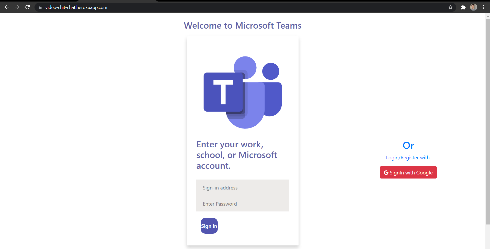
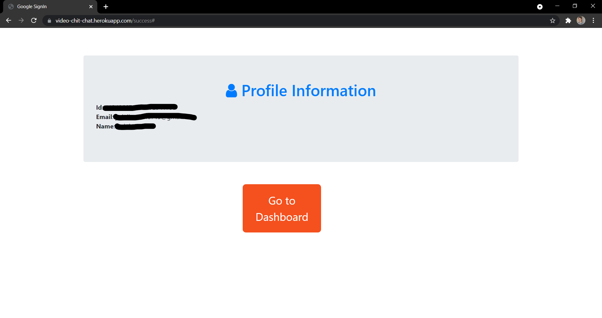
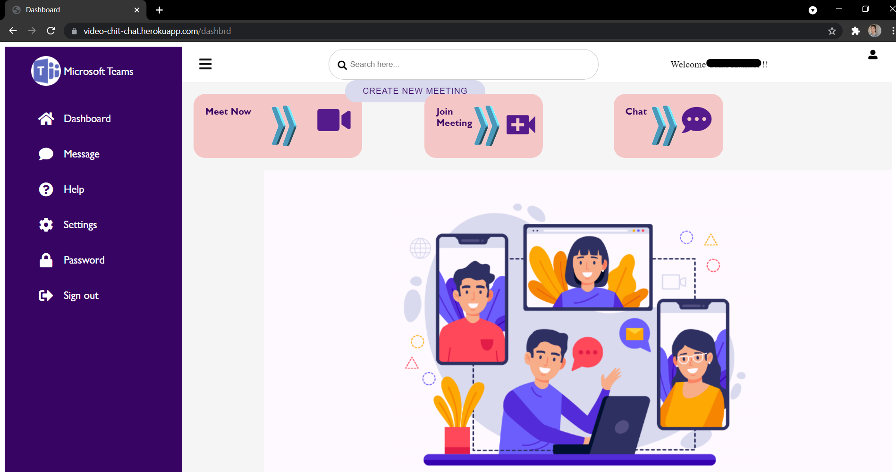
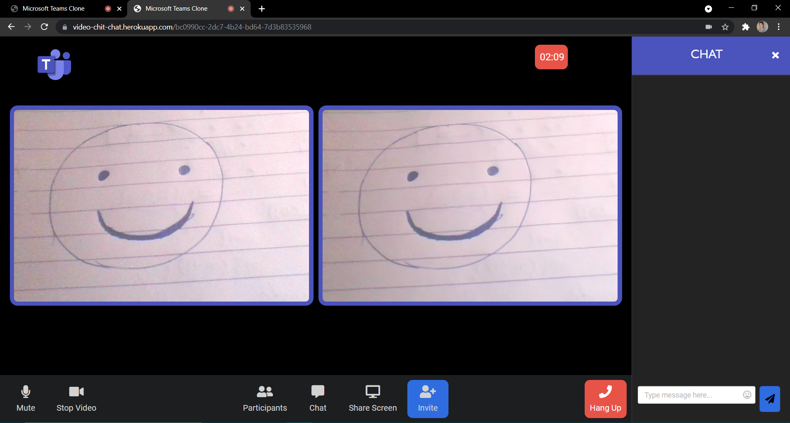

# Video-Chit-Chat(Microsoft Teams Clone)

**What is this project about ?⚒️**

This project is a video chat web application which you can use to connect with people around the world. You dont need to install any application just go to the url, login and start a new meeting or join an existing meeting

**What are the main features of this App? 🔐**

- Video Call 📹
- Audio Call 📞
- Screen-share🖥️
- Text chat with emojis👍
- See the Participants List
- Mute/Unmute Audio🔇
- Stop/Start Video⏹️
- Login using Google🔒
- Join/Leave Meeting

**What is unique about this App?✨**

After ending the meeting you dont lose your chat or say someone joins late then they can also catch up with the chat. You just have to go to the same meeting room and you can continue your chat right there or may be catch up with the chat there.

## Requirements to build this amazing app ? 📒

Following are the different libraries/fameworks used:

- Node js
- Peerjs
- Express
- Express-session
- Mongodb
- Mongoose
- Passport
- Socket io
- uuid
- emojionearea
- ejs

**How to run this app?📲**

You can go to the link https://video-chit-chat.herokuapp.com/ and check it out.

Or

- Clone this repo 👩‍💻
- Open project file in terminal. 💻
- Run ```npm init```
- Run locally using - `nodemon server.js`
- Do star this repo and/or contribute if you like it.🙂

# Snapshots of App 📸

- Home Page
- Successful Login
  
- Dashboard
  
- Meet
  
- Chat
  
